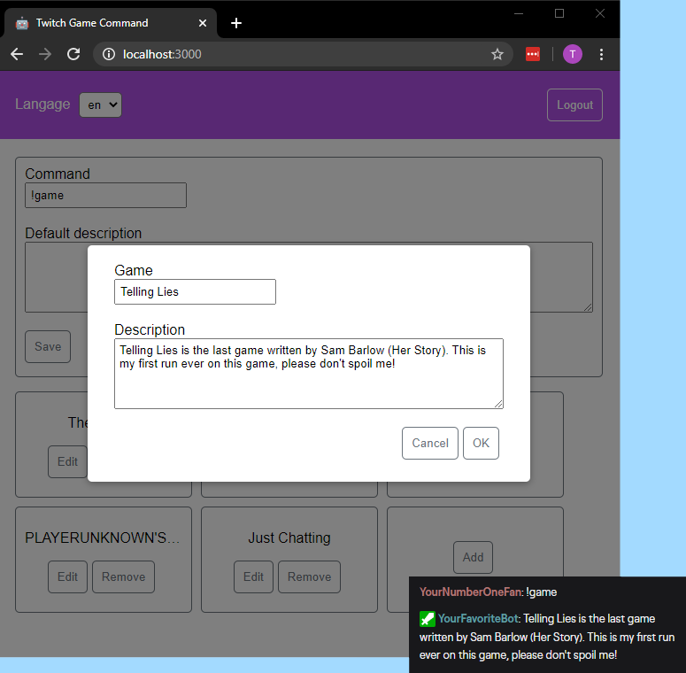

# Twitch Game Command

A twitch bot that answers to a command **depending on the current game being played**.



## Running it on your personal computer

- Download the last version on the [releases page](https://github.com/thomaslule/twitch-game-command/releases).
- Unzip it.
- Open the file named `.env` with your notepad.
- Follow the instructions to put all the configuration the bot needs (like your channel name and the bot account).
- Launch the executable file (Windows will probably be suspicious because the file isn't signed). If the window closes immediately, there is probably an error in the `.env` file. You can launch the executable from a terminal window to read the error.

Now that the bot is started, you can head to http://localhost:3000 in your browser to begin writing your own commands.

The bot will be active as long as the window stays open.

## Deploying it to a server

The preferred way is to use the [docker image](https://hub.docker.com/repository/docker/thomaslule/twitch-game-command).

Or to manually build the bot from the source:

```bash
npm run build
cd backend
cp .env.template .env # then fill the .env file
npm start
```
